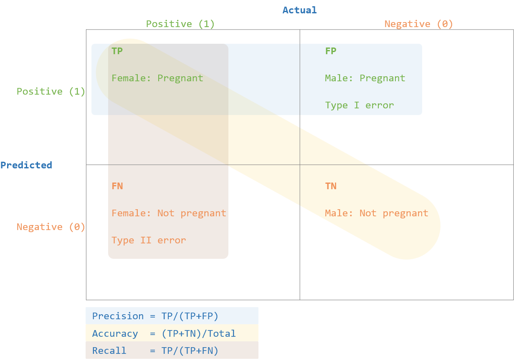

---
hide:
    # - navigation
    - toc
    - footer
---

<!-- hide page heading -->
<!-- <h1 style="padding:0 margin-top:0px"></h1>  -->

# ROC & AUC

??? bookmark "Bookmarks"
    {{ read_excel('docs/tables/bookmarks.xlsx', sheet_name='ml_roc_auc', engine='openpyxl') }}

??? term "Terms"

    {{ read_excel('docs/tables/terms.xlsx', sheet_name='ml_roc_auc', engine='openpyxl') }}

??? cactus "Confusion Matrix"

    {: .center style="height: 75%; width: 75%; border-radius: 5px;" loading=lazy}

    Confusion Matrix is cross-tabulation of actual vs predicted values

    It is used to see how well the model has performed

??? label "Accuracy"

    $$Accuracy = \frac{TP+TN}{Total}$$

    Overall, how often is the classifier correct.

??? label "Precision"

    $$Precision = \frac{TP}{TP + FP}$$

    When model predicts yes, how often is it correct?

    Precision should be as high as possible.

    A not precise model may find a lot of the positives, but its selection method is noisy. 
    &emsp;It also wrongly detects many positives that aren’t actually positives.

    A precise model is very pure maybe it does not find all the positives. 
    &emsp;But the ones that the model does class as positive are very likely to be correct.

??? label "Recall | Sensitivity | True Positive Rate"

    $$ Recall = \frac{TP} {TP + FN}$$

    Recall should be as high as possible.

    True positive rate measures the proportion of positives that are correctly identified as such, 
    &emsp;E.g. the percentage of sick people who are correctly identified as having the condition.

    Sensitivity refers to the test's ability to correctly detect patients who do have the condition.

    A model with high recall succeeds well in finding all the positive cases in the data, 
    &emsp;even though they may also wrongly identify some negative cases as positive cases.

    A model with low recall is not able to find all (or a large part) of the positive cases in the data.

??? label "F1 score"

    $$F1 \ score = 2 * \frac{Precision \ * Recall}{Precision \ + Recall}$$

    The F1 score is defined as the harmonic mean of precision and recall.
    
    F1 score gives equal weight to Precision and Recall.

    A model will obtain a high or low F1 score if both Precision and Recall are high or low.

    A model will obtain a medium F1 score if one of Precision and Recall is low and the other is high.

??? label "Specificity | True Negative Rate"

    $$Specificity = \frac{TN} {TN + FP}$$

    True negative rate measures the proportion of negatives that are correctly identified as such, 
    &emsp;E.g., the percentage of healthy people who are correctly identified as not having the condition.

    Specificity relates to the test's ability to correctly detect patients without a condition.

??? label "False Positive Rate"

    $$False \ Positive \ Rate = 1 - Specificity$$

??? label "Error Rate | Misclassification Rate"

    $$Misclassification \ Rate = \frac{FP+FN}{Total or 1 - Accuracy}$$

    Misclassification Rate or Error Rate tells overall, how often model classification is wrong?

??? label "Prevalence"

    $$Prevalence = \frac{Actual \ Yes}{Total}$$

    How often does the yes condition actually occur in our sample.

[^1]: Above notes are taken most likely from bookmarks.
