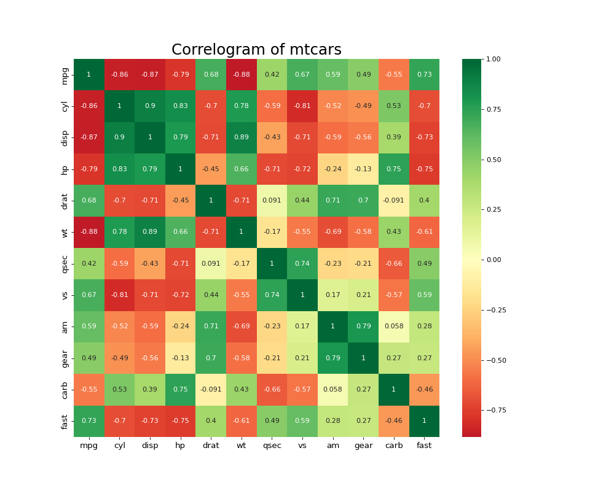
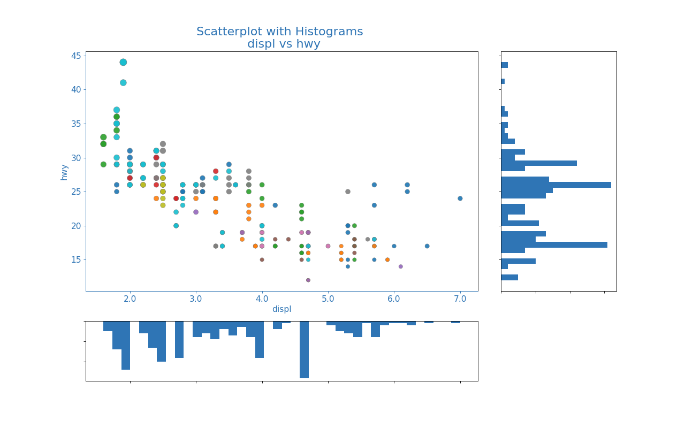
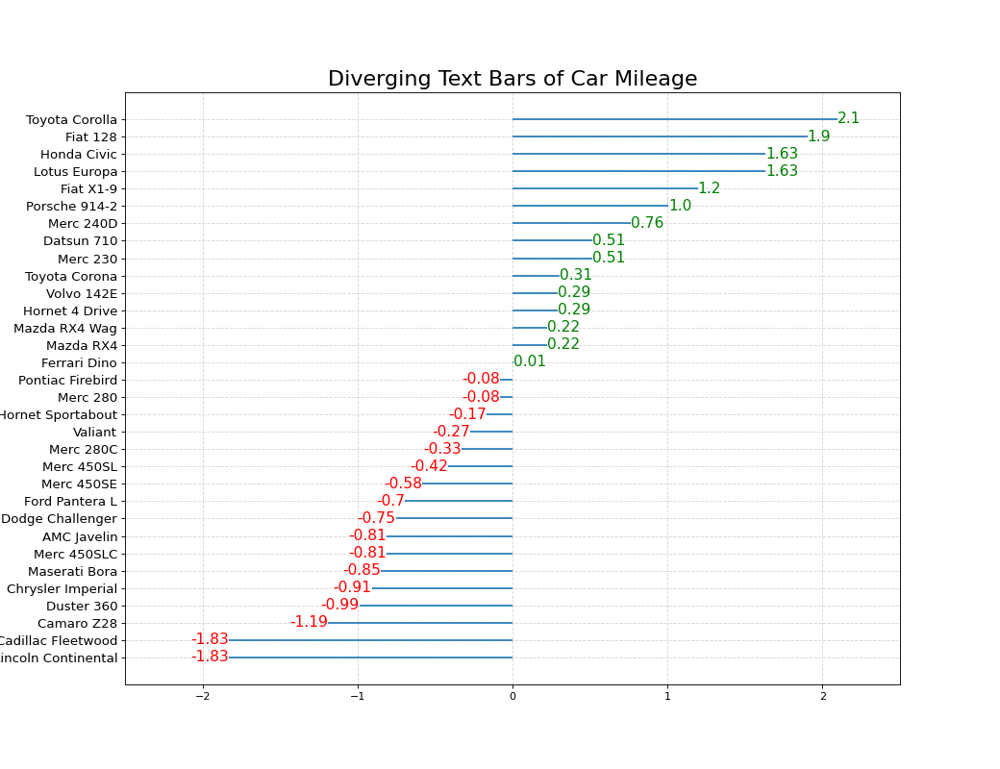
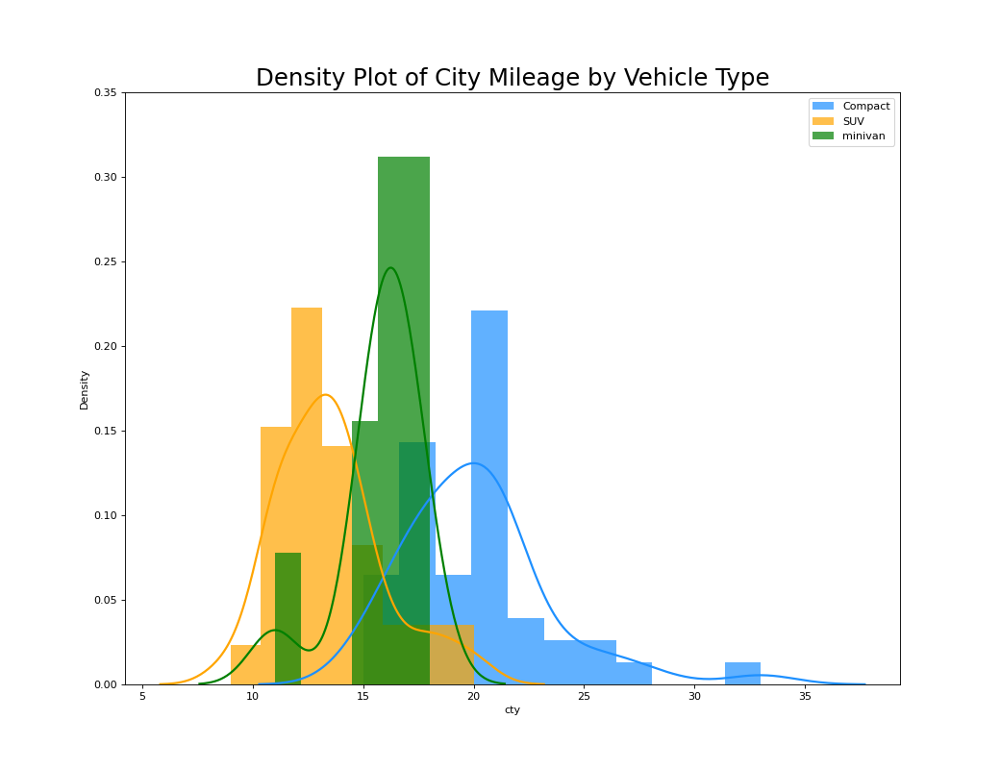

## Library

<h1 style="padding:0 margin-top:0px"></h1>

### correlation

<div class="gallery">
	<a href="gallery/correllogram.png"
		class="glightbox"
		data-description = "This is a plot."
		data-title='<a href="#correllogram">Know more about correllogram</a>'>
		
	</a>
	<a href="gallery/marginal_histogram.png"
		class="glightbox"
		data-description = "This is a plot."
		data-title='<a href="#marginal-histogram">Know more about marginal histogram</a>'>
		
	</a>

</div>

### deviation

<div class="gallery">
	<a href="gallery/diverging_texts.png"
		class="glightbox"
		data-description = "Diverging texts helps compare data points across time."
		data-title='<a href="#diverging-texts">Know more about diverging texts</a>'>
		
	</a>

</div>

### distribution

<div class="gallery">
	<a href="gallery/density_curves_with_histogram.png"
		class="glightbox"
		data-description = "abcd."
		data-title='<a href="#density-curves-with-histogram">Know more about density curves with histogram</a>'>
		
	</a>

</div>

## Guide

??? console-line "&nbsp;"

	### correllogram

	{ : .center width=100% data-title="correllogram" data-description="This is a plot." data-gallery="correlation"}

	```.py linenums="1"
	--8<-- "C:/my disk/edupunk/automation/visual library/correlation/correllogram.py"
	```

??? console-line "&nbsp;"

	### marginal histogram

	{ : .center width=100% data-title="marginal histogram" data-description="This is a plot." data-gallery="correlation"}

	```.py linenums="1"
	--8<-- "C:/my disk/edupunk/automation/visual library/correlation/marginal_histogram.py"
	```

??? console-line "&nbsp;"

	### diverging texts

	{ : .center width=100% data-title="diverging texts" data-description="Diverging texts helps compare data points across time." data-gallery="deviation"}

	```.py linenums="1"
	--8<-- "C:/my disk/edupunk/automation/visual library/deviation/diverging_texts.py"
	```

??? console-line "&nbsp;"

	### density curves with histogram

	{ : .center width=100% data-title="density curves with histogram" data-description="abcd." data-gallery="distribution"}

	```.py linenums="1"
	--8<-- "C:/my disk/edupunk/automation/visual library/distribution/density_curves_with_histogram.py"
	```

