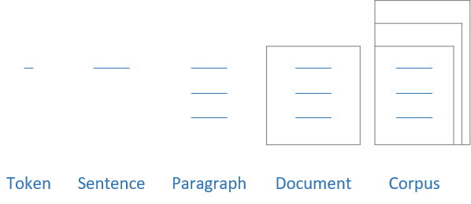

---
hide:
    # - navigation
    # - toc
    - footer
---

# Text mining

## Overview

!!! segment ""

    {: .center style="height: 75%; width: 75%; border-radius: 5px;" loading=lazy}

## Count vector representation

!!! segment ""

    Count vector representation is a common technique used in natural language processing (NLP) to convert text data into a numerical format that can be easily processed by machine learning algorithms. The basic idea behind count vector representation is to represent each document in a corpus as a vector of word counts.

    In count vector representation, the first step is to create a vocabulary of all the unique words that appear in the corpus. Then, for each document, the count of each word in the vocabulary is computed and represented as a vector. For example, if the vocabulary contains the words "cat", "dog", and "house", and a document contains the words "cat", "cat", "dog", and "house", the count vector for that document would be [2, 1, 1], representing the counts of "cat", "dog", and "house" respectively.

## Lemmatization

!!! segment ""

    Lemmatization is the process of reducing words to their base or dictionary form, called the lemma. Unlike stemming, which only removes the suffixes of words, lemmatization takes into account the context and the part of speech (POS) of the word to determine its root form. For example, the lemma of "am", "are", and "is" is "be", and the lemma of "running" is "run".

    Lemmatization is a more complex process than stemming, but it is more accurate in preserving the meaning of words.

    Computationally expensive compared to stemming.

## Stemming

!!! segment ""

    Stemming is the process of reducing a word to its base or root form.

    The goal of stemming is to remove the suffixes and prefixes of a word and convert it into its basic form, called the stem. For example, the stem of the word "running" is "run". The stem of the word "cats" is "cat". The stem of the word "jumped" is "jump".

## Term frequency (TF)

!!! segment ""

    Term frequency (TF) is a metric used in natural language processing (NLP) to measure the frequency of a term in a document.

    In TF, the frequency of a term is simply the number of times it appears in a document. For example, if the word "cat" appears 5 times in a document of 100 words, the TF for "cat" in that document would be 0.05 (i.e., 5/100).

## Inverse Document Frequency

!!! segment ""

    The TF of a term is often normalized by the total number of words in the document, to account for document length. This normalized version is called the Term Frequency-Inverse Document Frequency (TF-IDF).

    TF does not take into account the relative importance of a term across multiple documents in a corpus. To address this limitation, TF is often combined with IDF (Inverse Document Frequency) to create the TF-IDF metric.

## Unigram, bigram, trigram

!!! segment ""

    A unigram is a single word or a token that represents a single word in a text. It is the simplest form of n-gram, which is a contiguous sequence of n words in a text. A unigram represents each word as a separate feature and considers each word independently of its context.

    Bigram is a sequence of two adjacent words or tokens in a text. It is a type of n-gram, which is a contiguous sequence of n words in a text. Unlike unigrams, which consider each word independently, bigrams capture the relationship between two consecutive words in a text.

    By considering pairs of words, bigrams can capture more context and meaning than unigrams. For example, the bigram "machine learning" is more informative than the unigrams "machine" and "learning" considered independently.

    One advantage of using trigrams as features is that they can capture more complex relationships between words. For example, the trigram "natural language processing" is more informative than the bigram "natural language", which in turn is more informative than the unigrams "natural", "language", and "processing" considered independently.

## Cosine similarity

!!! segment ""

    Cosine similarity is a measure of similarity between two non-zero vectors in an n-dimensional space.

    The cosine similarity measures the cosine of the angle between two vectors, where a value of 1 means the vectors are identical, a value of 0 means they are orthogonal, and a value of -1 means they are diametrically opposed. In practice, the cosine similarity ranges between 0 and 1, with a higher value indicating a greater degree of similarity between the vectors.

## Stop words

!!! segment ""

    Stop words are words that are commonly used in a language but are usually considered to be of little value in text analysis and search engine optimization.

    Examples of stop words in English include "the," "a," "an," "in," "and," "of," "to," "for," "is," "are," and "that."

