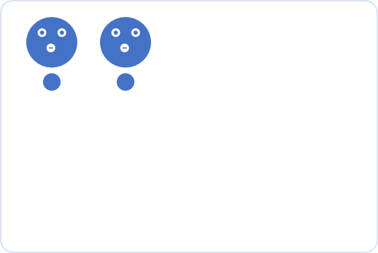
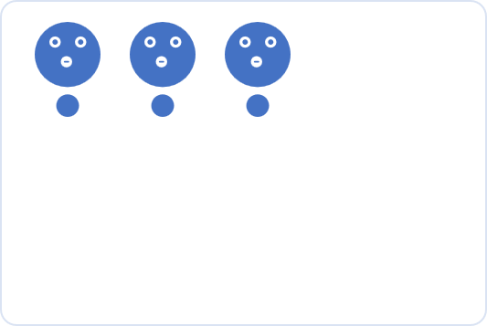
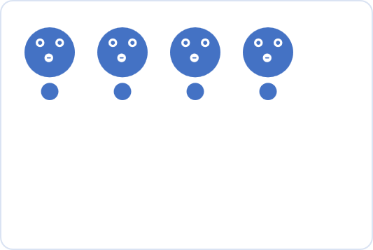
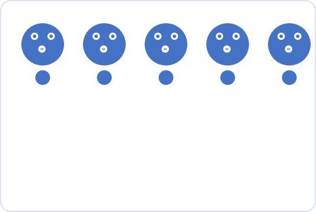
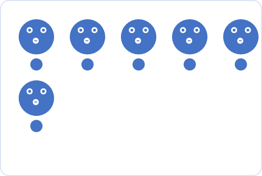

## Native

!!! image-outline ""

	### Title and description with attributes	

	!!! image-outline ""

		```
		{ data-title="image_with_1_figure" data-description="this_image_has_1_figure" }
		```

		{ data-title="image_with_1_figure" data-description="this_image_has_1_figure" }


	### data-caption-position
	
	!!! image-outline ""

		```
		{ data-title="image_with_2_figures" data-description="this_image_has_2_figures" data-caption-position="right"}
		```

		{ data-title="image_with_2_figures" data-description="this_image_has_2_figures" data-caption-position="right"}


	### Advanced description with hyperlink

	!!! image-outline ""

		```
		{ width=50% data-title="advance_description_title" data-description=".custom-desc3" }
		
		<div class="glightbox-desc custom-desc3">
		  <p>[check](#custom) this_is_first_advance_description_for_image_with_3_figures</p>
		  <p>this_is_second_advance_description_for_image_with_3_figures</p>
		</div>
		```

		{ width=50% data-title="advance_description_title" data-description=".custom-desc3" }
		
		<div class="glightbox-desc custom-desc3">
		  <p>[check](#custom) this_is_first_advance_description_for_image_with_3_figures</p>
		  <p>this_is_second_advance_description_for_image_with_3_figures</p>
		</div>


	### Autocaption

	!!! image-outline ""

		```
		
		```

		


	### Caption on page

	!!! image-outline ""

		```
		<figure markdown>
		{ width=50% }
		<figcaption>image_with_4_figures</figcaption>
		</figure>
		```

		<figure markdown>
		{ width=50% }
		<figcaption>image_with_4_figures</figcaption>
		</figure>


	### data-gallery

	!!! image-outline ""

		```
		Figure 1.
		
		{ width=20% data-title="image_with_1_figure" data-description="this_image_has_1_figure" data-gallery="jpg"}

		Figure 2.

		{ width=20% data-title="image_with_2_figures" data-description="this_image_has_2_figures" data-gallery="jpg"}

		Figure 3.

		{ width=20% data-title="image_with_3_figures" data-description="this_image_has_3_figures" data-gallery="png"}
		```

		Figure 1
		
		{ width=20% data-title="image_with_1_figure" data-description="this_image_has_1_figure" data-gallery="jpg"}

		Figure 2
		
		{ width=20% data-title="image_with_2_figures" data-description="this_image_has_2_figures" data-gallery="jpg"}

		Figure 3
		{ width=20% data-title="image_with_3_figures" data-description="this_image_has_3_figures" data-gallery="png"}


## Settings

!!! blur ""

	### Disable

	!!! image-outline ""

		```
		{ width=20% data-title="some_title" data-description="some_data_description" data-gallery="jpg" .off-glb}
		```

		{ width=20% data-title="some_title" data-description="some_data_description" data-gallery="jpg" .off-glb}


	### Disable glightbox on page

	```
	---
	glightbox: false
	---
	```


## Custom .css

### Image one below another

!!! blur ""

	```
	<div class="row">
	  <div class="col">
		<a href="img/1.png" class="glightbox">
		  
		</a>
	  </div>
	  <div class="col">
		<a href="img/2.jpg" class="glightbox">
		  
		</a>
	  </div>
	</div>
	```

	<div class="row">
	  <div class="col">
		<a href="img/1.png" class="glightbox">
		  
		</a>
	  </div>
	  <div class="col">
		<a href="img/2.png" class="glightbox">
		  
		</a>
	  </div>
	</div>


### Simple gallery

!!! blur ""
	=== "output"
		<div class="gallery">
		  <a href="img/1.png" class="glightbox">
			
		  </a>
		  <a href="img/3.png" class="glightbox">
			
		  </a>
		  <a href="img/4.png" class="glightbox">
			
		  </a>
		  <a href="img/5.png" class="glightbox">
			
		  </a>
		  <a href="img/6.png" class="glightbox">
			
		  </a>
		</div>
	=== ".html"
		```
		<div class="gallery">
		  <a href="img/1.png" class="glightbox">
			
		  </a>
		  <a href="img/3.png" class="glightbox">
			
		  </a>
		  <a href="img/4.png" class="glightbox">
			
		  </a>
		  <a href="img/5.png" class="glightbox">
			
		  </a>
		  <a href="img/6.png" class="glightbox">
			
		  </a>
		</div>
		```
	=== ".css"
		```css title='.css'
		/* glightbox gallery */
		.gallery {
			display: flex;
			flex-wrap: wrap;
			margin: -10px;
		  }
		  
		  .gallery a {
			flex-basis: 25%;
			box-sizing: border-box;
			padding: 10px;
		  }
		  
		  .gallery img {
			max-width: 100%;
			height: auto;
		  }
		  
		  /* animation*/
		  .gallery a {
			flex-basis: 25%;
			box-sizing: border-box;
			padding: 10px;
			transition: transform 0.2s ease-in-out;
		  }
		  
		  .gallery a:hover {
			transform: scale(1.05);
		  }
		```


## Custom

## Simple gallery with advance description

!!! blur ""
	=== "output"
		<div class="gallery">
		  { width=100% data-title="advance_description_title" data-description=".custom-desc-adv" }
			<div class="glightbox-desc custom-desc-adv">
			  <p>this_is_first_advance_description_for_simple_gallery</p>
			  <p>this_is_second_advance_description_for_simple_gallery</p>
			</div>
		  { width=100% data-title="advance_description_title" data-description=".custom-desc-adv1" }
			<div class="glightbox-desc custom-desc-adv1">
			  <p>this_is_first_advance_description_for_simple_gallery_1</p>
			  <p>this_is_second_advance_description_for_simple_gallery_1</p>
			</div>
		</div>
	=== "html"
		```
		<div class="gallery">
		  { width=100% data-title="advance_description_title" data-description=".custom-desc-adv" }
			<div class="glightbox-desc custom-desc-adv">
			  <p>this_is_first_advance_description_for_simple_gallery</p>
			  <p>this_is_second_advance_description_for_simple_gallery</p>
			</div>
		  { width=100% data-title="advance_description_title" data-description=".custom-desc-adv1" }
			<div class="glightbox-desc custom-desc-adv1">
			  <p>this_is_first_advance_description_for_simple_gallery_1</p>
			  <p>this_is_second_advance_description_for_simple_gallery_1</p>
			</div>
		</div>
		```
